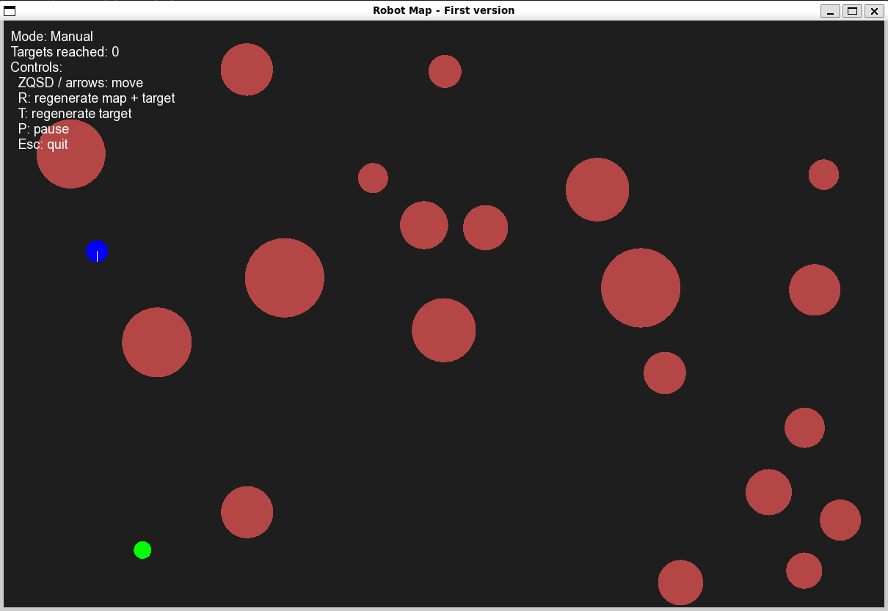

# autonomous-mobile-robot

Small C++ simulation project of a mobile robot moving in a 2D environment with randomly generated obstacles and a target to reach.



## Features
- Window creation
- 2D map rendering
- Random obstacle generation
- Configurable map size
- Configurable obstacle count
- JSON config loading
- manual robot control
- automatic navigation mode

## Automatic navigation

In automatic mode, the robot computes a path from its current position to the target and then follows the generated waypoints.

For the path planner, I used the **BFS algorithm** (**Breadth-First Search**).

The environment is first converted into a grid:
- each grid cell represents a small area of the map
- blocked cells correspond to obstacles or unsafe zones
- free cells can be explored by the planner

Then BFS is used to:
1. start from the robot cell
2. explore neighboring cells layer by layer
3. stop when the target cell is reached
4. reconstruct the path from the target back to the start
5. convert the grid path into world-space waypoints

I chose BFS because:
- it is simple and robust
- it is easy to implement and debug
- it guarantees a valid path on the grid when one exists
- it is well suited for a first autonomous navigation version

## Manual mode

In manual mode, the robot can be controlled with the keyboard to move inside the map and reach the target.

Example controls:
- `ZQSD` or arrow keys to move
- `M` to switch to auto mode
- `R` to regenerate the map and the target
- `T` to regenerate only the target
- `P` to pause
- `Esc` to quit

## Config
The application loads its configuration from:

```bash
config/config.json
```

Configurable values:
- window size
- map size
- obstacle count
- obstacle radius range
- random seed
- robot size
- target size

## Build

This project uses **CMake**.

Example build steps:

```bash
mkdir build
cd build
cmake ..
make
```

## Run
From the **build** folder:
```bash
./robot_target ../config/config.json
```

## Purpose of the project

This project was designed as a practical portfolio project to demonstrate:

- C++ programming
- modular software design
- basic robotics/navigation concepts
- graphical simulation
